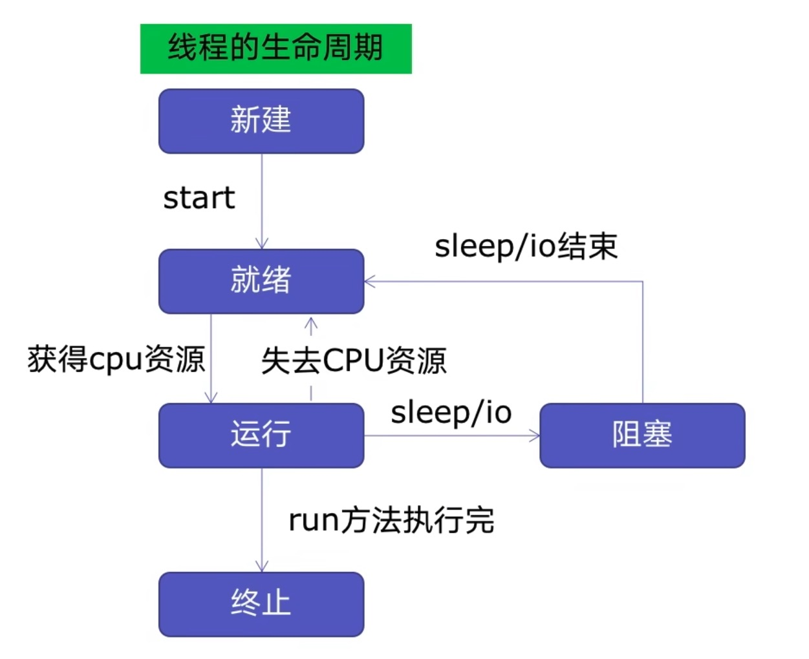

# Thread Pool

## 线程池的原理


新建线程系统需要分配资源，终止线程系统需要回收资源。如果可以重用线程，则可以减去新建/终止的开销。
## 使用线程池的好处
1. 提升性能：因为减去了大量新建，终止线程的开销，冲用了线程资源；
2. 适用场景：适用处理突发性大量请求或需要大量线程完成任务，但实际处理实际较短。
3. 防御功能：能有效避免系统因为创建线程过多，而导致系统负荷过大相应变慢等问题。
4. 代码优势：使用线程池的语法比自己新建线程执行线程更加简洁。

## ThreadPoolEexecutor的使用语法

```python
from concurrent.futures import ThreadPoolExecutor, as_completed
```

- 用法一： map函数，很简单，注意map的结果和入参是顺序对应的
```python
with ThreadPoolExecutor() as pool:
    results = pool.map(craw,urls)
    for result in results:
        print(result)
```
  
- 用法二：future模式，更强大，注意如果用as_completed顺序是不定的

```python
with ThreadPoolExecutor as pool:
    
    futures = [pool.submit(craw,url) for url in urls]
    
    for future in futures:
        print(future.result())
    for future in as_completed(futures):
        print(future.result())
```

## 使用线程池改造爬虫程序